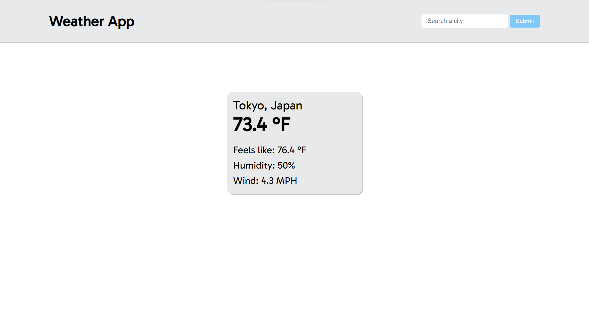

# Weather-App

# Overview

[Live Site](https://purpleboxe.github.io/Weather-App/)

## Preview

## The process

### Built with

- HTML5
- CSS
- JS
- Webpack

### What I learned

In this project I learned how to use an api. This was a bit challenging as I couldn't get it to work at first however
after many tries I finally got it working.

## Conclusion

This app was a very simple one to make and it serves its purpose.